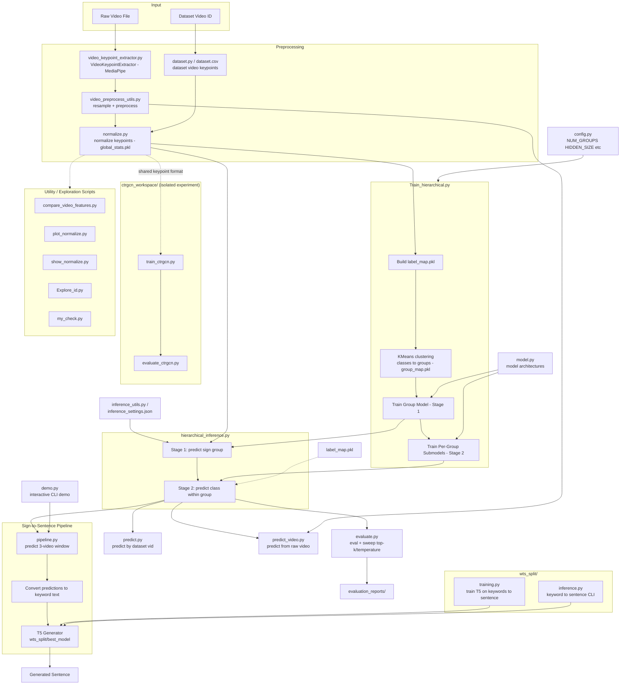

# Sign Language Detection and Sentence Generation

This repository contains a sign-language recognition project built around a hierarchical classifier for isolated sign prediction, plus an optional text-generation stage that converts predicted sign keywords into natural-language sentences.

The project includes:

- A hierarchical sign classifier for large-class prediction
- Raw-video inference using extracted keypoints
- Evaluation and inference-setting sweeps
- A sign-to-sentence pipeline based on `T5`
- A separate `CTRGCN` experiment workspace

## Project Overview

The main recognition pipeline works in two stages:

1. A group model predicts which sign group a sample belongs to.
2. A group-specific submodel predicts the final sign class inside that group.

This reduces a very large classification problem into a more manageable hierarchical setup.

The repository also includes a second-stage language model pipeline that takes a short sequence of predicted signs and generates a natural sentence from them.

## Architecture



## Main Components

- `Train_hierarchical.py`
  Trains the hierarchical classifier:
  - builds label maps
  - normalizes keypoint sequences
  - clusters classes into groups with feature-based `KMeans`
  - trains the stage-1 group model
  - trains one stage-2 submodel per group

- `evaluate.py`
  Evaluates the hierarchical system on the test split and can sweep inference settings such as:
  - top-k groups
  - top-k classes
  - temperature
  - group-score power

- `predict.py`
  Runs prediction for a dataset video ID using saved artifacts.

- `predict_video.py`
  Runs prediction directly from a raw video file by:
  - extracting keypoints
  - resampling and normalizing the sequence
  - running hierarchical inference
  - printing top predictions and basic quality diagnostics

- `pipeline.py`
  Combines sign prediction with a `T5` text generator to produce sentences from a window of predicted signs.

- `demo.py`
  Interactive CLI demo for the end-to-end sign-to-sentence pipeline.

- `ctrgcn_workspace/`
  Separate experimental workspace for a `CTRGCN`-style model using the same keypoint format.

- `wts_split/`
  Training and inference code for the keyword-to-sentence generation model.

## Repository Structure

```text
sign_language_detection/
|-- README.md
|-- .gitignore
|-- config.py
|-- dataset.py
|-- model.py
|-- normalize.py
|-- Train_hierarchical.py
|-- hierarchical_inference.py
|-- evaluate.py
|-- predict.py
|-- predict_video.py
|-- pipeline.py
|-- demo.py
|-- video_keypoint_extractor.py
|-- video_preprocess_utils.py
|-- inference_utils.py
|-- ctrgcn_workspace/
|-- wts_split/
|-- evaluation_reports/
```

Large datasets, checkpoints, and generated artifacts are intentionally excluded from GitHub through `.gitignore`.

## Data and Artifacts

The code expects local dataset and artifact files such as:

- `data_map_FDMSE-ISL_keypoints.pkl`
- `vid_class_FDMSE-ISL.pkl`
- `vid_splits_FDMSE-ISL.pkl`
- `class_map_FDMSE-ISL.csv`
- trained artifact files like:
  - `global_stats.pkl`
  - `label_map.pkl`
  - `group_map.pkl`
  - `group_model.pt`
  - `submodels/group_*.pt`

These files are not suitable for a normal GitHub push because some of them are very large.

## Environment Setup

Create and activate a Python environment, then install the required packages.

Example:

```powershell
python -m venv .venv
.venv\Scripts\activate
pip install torch torchvision torchaudio numpy pandas scikit-learn transformers
pip install opencv-python mediapipe
```

Depending on your code path, you may also need:

```powershell
pip install matplotlib
```

If you use GPU acceleration, install the CUDA-compatible version of `PyTorch` for your system.

## Configuration

Main configuration lives in `config.py`.

Important settings include:

- `NUM_GROUPS`
- `HIDDEN_SIZE`
- `NUM_LAYERS`
- `BATCH_SIZE`
- `EPOCHS`
- `LR`
- `GROUP_SCORE_POWER`

Artifacts are controlled through:

- `SLD_ARTIFACT_DIR`
- `SLD_ENSEMBLE_DIRS`
- `SLD_SEED`

By default, the project reads and writes artifacts from the current directory unless `SLD_ARTIFACT_DIR` is set.

## Training the Hierarchical Classifier

Run:

```powershell
python Train_hierarchical.py
```

This script will:

- load raw sign data
- build class labels
- normalize keypoint features
- cluster classes into groups
- train the group classifier
- train one submodel per group
- save training artifacts

## Evaluating the Model

Run a normal evaluation:

```powershell
python evaluate.py
```

Run a hyperparameter sweep:

```powershell
python evaluate.py --sweep --save-best-settings
```

Generated reports are written to `evaluation_reports/`.

## Predicting from Dataset Video IDs

To test on a video ID already present in the dataset:

```powershell
python predict.py --vid YOUR_VIDEO_ID
```

You can also specify alternate artifact directories:

```powershell
python predict.py --vid YOUR_VIDEO_ID --artifact-dirs "artifacts\\run1,artifacts\\run2"
```

## Predicting from a Raw Video File

To predict directly from a raw input video:

```powershell
python predict_video.py --video path\\to\\input.mp4
```

Useful options:

```powershell
python predict_video.py --video path\\to\\input.mp4 --topk 5 --target-frames 150
python predict_video.py --video path\\to\\input.mp4 --match-dataset-scale
```

This path uses `VideoKeypointExtractor` and preprocessing utilities before running hierarchical inference.

## Sign-to-Sentence Pipeline

The repository also includes a pipeline that converts a small sequence of predicted signs into a sentence.

Run the demo:

```powershell
python demo.py
```

Other modes:

```powershell
python demo.py --mode manual
python demo.py --mode batch --n 5
```

The pipeline:

1. Predicts signs for a 3-video window
2. Converts them into keyword text
3. Uses a `T5` generator to produce sentence candidates

## Training the Sentence Generator

Inside `wts_split/`, train the keyword-to-sentence model:

```powershell
cd wts_split
python training.py
```

Run inference for custom keywords:

```powershell
python inference.py --keywords "hello thank-you help"
```

The trained `T5` model is saved under:

```text
wts_split/best_model/
```

This folder is ignored in Git because it contains large model files.

## CTRGCN Experiment Workspace

The `ctrgcn_workspace/` folder is an isolated experiment area for graph-based sign modeling.

Run:

```powershell
cd ctrgcn_workspace
python train_ctrgcn.py
python evaluate_ctrgcn.py --checkpoint artifacts\best_model.pt
```

This keeps graph-model experiments separate from the main hierarchical pipeline.
